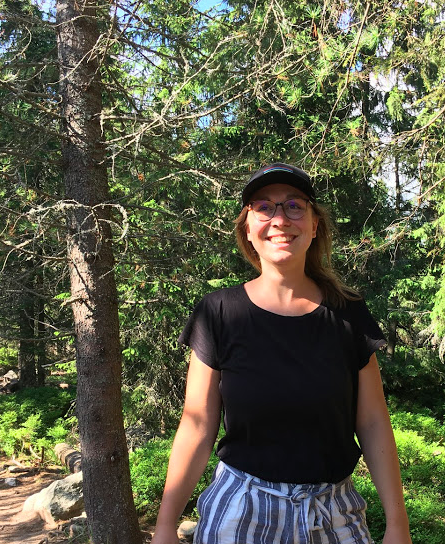

Hallo Ihr Liebä!

Ich bin Laura, 27, Frohnatur, Zugfahrende, Tee- und Bierliebhaberin und Pflanzenmami und interessiere mich für eines der freien Zimmer bei euch. Eure Wohnung sieht mega schön aus! Immer wenn ich am Hunzikerareal vorbeivelöle denke ich mir, dass es bestimmt cool ist, da zu wohnen. 

Anzutreffen bin ich normalerweise irgendwo in den Bergen, bei Spieleabenden und am Znachttisch mit Freunden, auf kleineren Velotouren oder an Konzerten. Ich habe gerade mein Geographie-Studium abgeschlossen und suche nun eine Stelle in der Verkehrsplanung. 

Ich habe schon in verschiedensten WGs gewohnt (von gross bis klein und von toll bis naja). Weil ich ab und zu auf längere Reisen gegangen bin, musste ich relativ häufig die Wohnung wechseln, was mit der Zeit ziemlich anstrengend wird. Nun suche ich einen Ort, wo ich etwas länger wohnen kann und wo ich mich zu Hause fühle - vielleicht ist das ja bei euch in der WG.. Ich bin bitzli ein Harmonie-Junkie und bin froh, wenn Unstimmigkeiten schnell geklärt werden. Ausserdem mag ich es, wenn die Gemeinschaftsräume und vor allem die Küche sauber sind - dann koche ich nämlich sehr gerne (vegetarisch). Ich bin zwar normalerweise ein paar Abende die Woche unterwegs, für gemeinsame Znacht und Unternehmungen bin ich sonst aber gerne zu haben. Ich mag es, wenn etwas los ist und alle motiviert sind, anzupacken. 

Denkt ihr, das könnte passen? Ich würde mich sehr freuen, euch bald kennenzulernen! :)

Liebe Grüsse,

Laura

